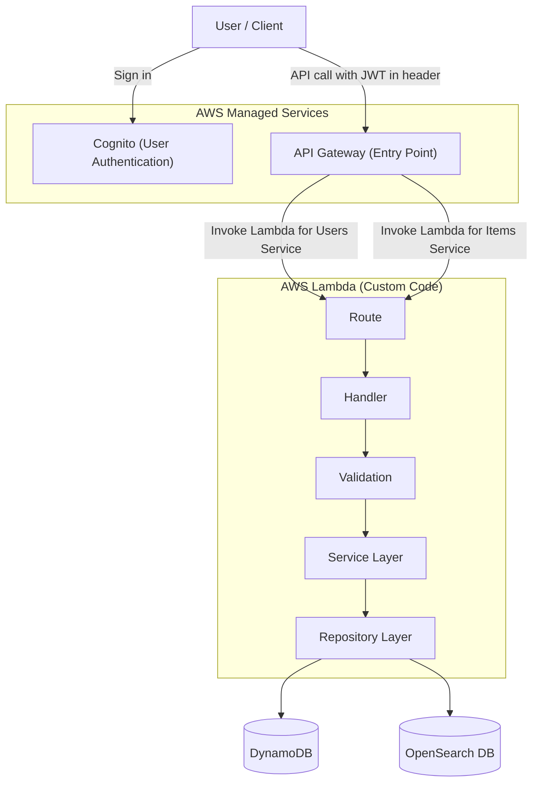

# 🏗️ Go Serverless Microservices


[](https://go.dev)
[](./LICENSE)
[](https://github.com/usman250994/go-serverless-microservices/actions)


> **Scalable, maintainable, and production-ready microservices in Go, powered by Clean Architecture & DDD.**

---

## ✨ Key Features

- 🧹 **Clean Architecture**: Handlers → Services → Models
- 🏛️ **Domain-Driven Design (DDD)**: Modular, business-focused code
- 📦 **Scalable Structure**: Add new domains/services with zero coupling
- 🔌 **Flexible Integration**: REST, gRPC, GraphQL ready
- 🧪 **Testable Services**: Clear boundaries for easy testing
- ⚡ **Minimal Boilerplate**: Production-ready from the start

---


## 🗺️ Architecture Overview



**How it works:**
- Users authenticate with Cognito and receive a JWT token.
- API requests include the JWT in the Authorization header.
- API Gateway forwards requests to the appropriate Lambda (users/items).
- Each Lambda's main.go calls the internal route, which calls the handler.
- The handler validates/authenticates the JWT, then calls the service layer for business logic.
- The service layer calls the repo layer for DB operations (DynamoDB for users, OpenSearch for items).

---

## 📂 Project Structure

```text
cmd/
 └── users/
   └── main.go        # Entry point for Users microservice
internal/
 └── users/
   ├── routes.go      # Routes & handler mapping
   ├── handler.go     # HTTP handlers
   ├── service.go     # Business logic
   └── model.go       # Domain models/entities
   └── repo.go        # crud operations for db
   └── type.go        # request response types for validation
```

---


## 🚀 How It Works

- **main.go**: Lambda entry point, loads config, sets up router, and starts the service.
- **routes.go**: Registers endpoints and maps them to handlers.
- **handler.go**: Processes requests, extracts and validates JWT from headers, and calls the service layer.
- **type.go**: Contains request/response DTOs for validation.
- **service.go**: Contains business logic and orchestrates workflows.
- **model.go**: Defines domain entities and data structures.
- **repo.go**: Handles DB operations (DynamoDB for users, OpenSearch for items).

---

---

## 🛠️ Tech Stack

- **Language**: Go (Golang)
- **Cloud**: AWS (tested with Cognito, Api gateway and lambdas)
- **Architecture**: Clean Architecture + DDD
- **Routing**: chi
- **Persistence**: Extendable (DynamoDB)
- **Validation**:  go-playground/validator
- **Authentication**:  using jwt for extracting userId

---

## 🧭 Principles

- ✅ **Single Responsibility**: Each layer does one job
- ✅ **Dependency Inversion**: Inner layers never depend on outer
- ✅ **Explicit Boundaries**: Clear contracts between layers
- ✅ **Scalability**: Easily add new domains

---

## 🚀 Getting Started


### 1. Prerequisites

- **[Create an AWS Account](https://portal.aws.amazon.com/billing/signup)** if you don't have one.
- Install [Go](https://go.dev/dl/) (1.22+ recommended).
- Install [AWS CLI](https://docs.aws.amazon.com/cli/latest/userguide/getting-started-install.html) and configure your credentials:
  ```sh
  aws configure
  ```


### 2. Set Up AWS Services

- **Cognito**: [Create a User Pool](https://docs.aws.amazon.com/cognito/latest/developerguide/cognito-user-identity-pools.html) and an App Client (enable USER_PASSWORD_AUTH). [Quickstart Guide](https://docs.aws.amazon.com/cognito/latest/developerguide/tutorial-create-user-pool.html)
  - Add a test user via AWS Console or CLI.
  - Use the AWS Console or [AdminCreateUser CLI](https://docs.aws.amazon.com/cli/latest/reference/cognito-idp/admin-create-user.html).
  - **Get a JWT token for your test user:**
    ```sh
    curl -X POST -H "Content-Type: application/x-amz-json-1.1" \
      -H "X-Amz-Target: AWSCognitoIdentityProviderService.InitiateAuth" \
      -d '{"AuthParameters": {"USERNAME": "<your_email>", "PASSWORD": "<your_password>"}, "AuthFlow": "USER_PASSWORD_AUTH", "ClientId": "<your_cognito_app_client_id>"}' \
      https://cognito-idp.<region>.amazonaws.com/
    ```
    - Copy the `IdToken` from the response and use it as your JWT in API requests.
- **DynamoDB**: [Create a Table](https://docs.aws.amazon.com/amazondynamodb/latest/developerguide/GettingStarted.html) (e.g., `users`).
- **Lambda**: [Deploy your Go binary as a Lambda function](https://docs.aws.amazon.com/lambda/latest/dg/golang-handler.html) if you want to run on AWS. You can also run locally with `go run ./cmd/users/main.go` for quick testing and development.
- **OpenSearch** (optional, for items service): [Create a domain](https://docs.aws.amazon.com/opensearch-service/latest/developerguide/gsgcreate-domain.html) and index. **Warning:** OpenSearch can incur significant costs if not managed carefully. Use the free tier or development domains for testing.

> **Note:** You do NOT need to set up API Gateway to test locally or to deploy your Lambda if you are invoking it directly or using the AWS Lambda console. API Gateway is only needed if you want to expose your Lambda as a public HTTP endpoint.

### 3. Configure Environment Variables

Create a `.env` file in your project root with:
```env
AWS_ACCESS_KEY_ID=your-access-key
AWS_SECRET_ACCESS_KEY=your-secret-key
AWS_REGION=your-region
USERS_TABLE=users
LOCAL=true
OPEN_SEARCH_END_POINT=https://your-opensearch-endpoint
OPEN_SEARCH_INDEX=your-index
```
> ⚠️ **Warning:** Never commit your `.env` file or secrets to version control.

### 4. Run Locally

```sh
# Clone repo
git clone https://github.com/usman250994/go-serverless-microservices.git

# Run users service locally
cd cmd/users
go run main.go

# Run items service locally (requires OpenSearch setup)
cd ../items
go run main.go
```


### 🧪 Test Your API (Postman or curl)

1. **Get a JWT token** (see Cognito curl above).
2. **Call the test endpoint:**

   **POST** `http://localhost:8080/user`

   **Headers:**
   - `Authorization: Bearer <your_id_token>`
   - `Content-Type: application/json`

   **Body (JSON):**
   ```json
   {
     "name": "john",
     "email": "doe@gmail.com",
     "ratings": 25.0,
     "userType": "renter"
   }
   ```

   > 🧑‍💻 This is a test API in this boilerplate. Fork and extend for your own product!

### 6. Deploy to AWS Lambda

- Build your Go binary for Linux:
  ```sh
  GOOS=linux GOARCH=amd64 go build -o main ./cmd/users/main.go
  zip deployment.zip main
  # Upload deployment.zip to Lambda via AWS Console or CLI
  ```
- Set environment variables in the Lambda console to match your `.env` file.
- Connect your Lambda to API Gateway for public access.

---

## ⚠️ OpenSearch Cost Warning

> **OpenSearch can incur significant costs if not managed carefully.**
> - Use the free tier or development domains for testing.
> - Delete unused domains promptly.
> - Monitor your AWS billing dashboard regularly.

---

## 🚧 Upcoming Features

- 🗄️ **Database Abstraction**: Internal package for DynamoDB access—cleaner, decoupled repo logic.
- 📡 **Event Streaming**: Integrate AWS SNS, SQS, and DynamoDB Streams for real-time event sourcing.
- 🔍 **Query Wrapper**: Generic query builder to simplify and standardize DynamoDB queries.

---

## 🤝 Contributing

Contributions are welcome! Open issues or PRs to improve structure or add features.

---

## 📜 License

MIT License – use this boilerplate for your own projects.

## Medium arcticle

  [go serverless microservices boiler plate](https://medium.com/@mani9418/go-serverless-microservices-a-clean-architecture-boilerplate-for-go-developers-474fc1c9c792)
